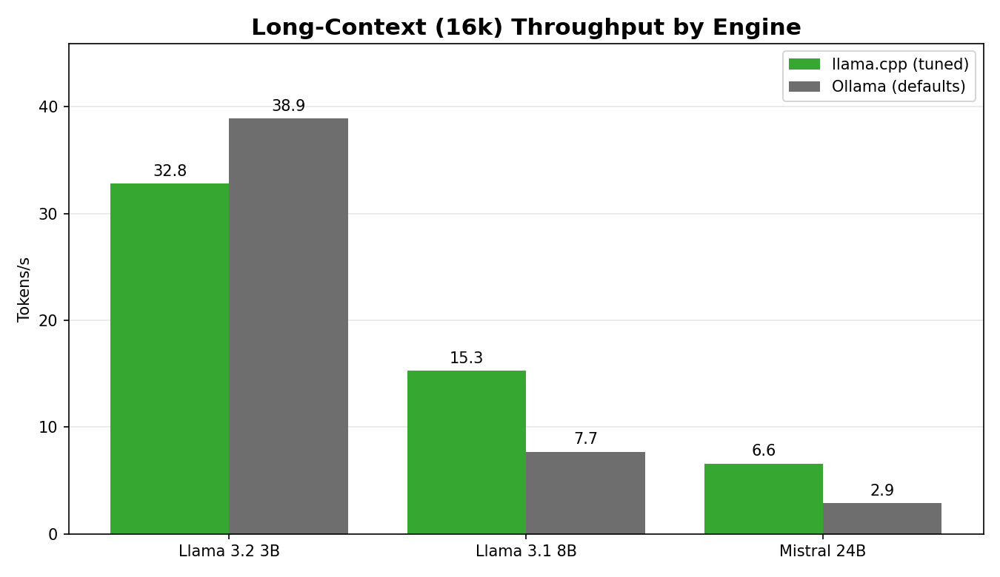
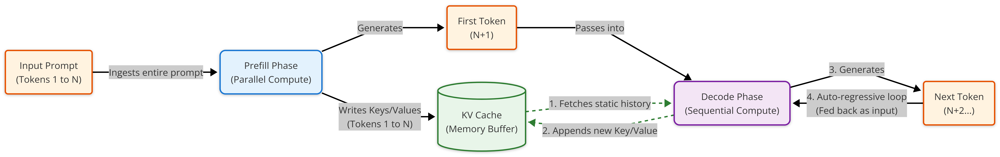
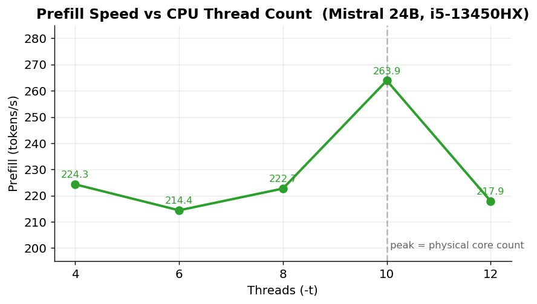
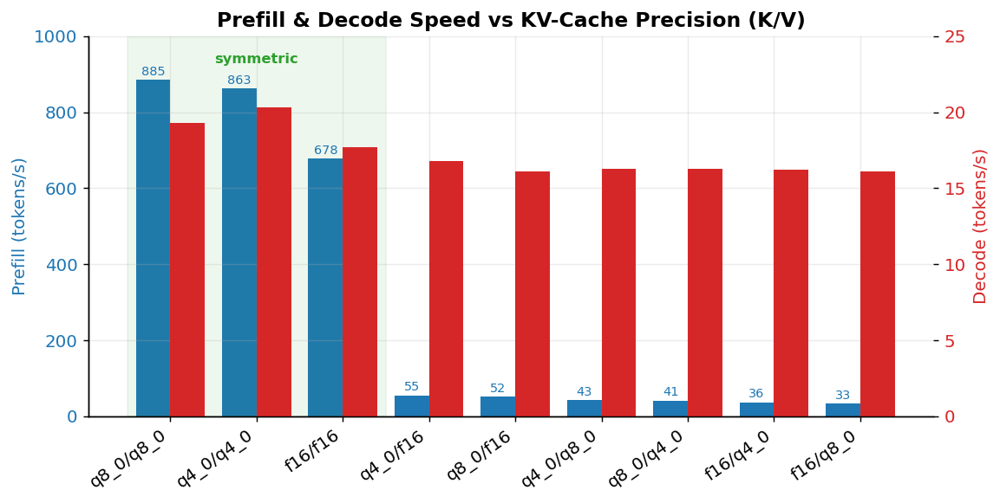
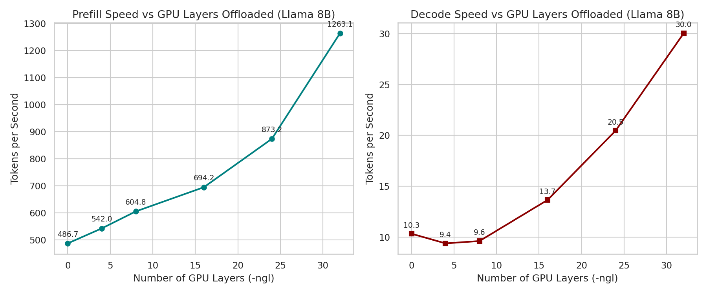

# local_llm_benchmarks

Reproducible benchmarks that measure the real cost of running local LLMs through a high-level wrapper (Ollama) versus bare-metal `llama.cpp` on constrained, single-GPU hardware. If you run inference on a 6GB consumer card and your tokens-per-second falls off a cliff the moment your context window grows, this repo quantifies exactly why, and shows the tuning flags that buy back up to ~2x throughput. Every number here was produced by automated sweeps on an Intel i5-13450HX + NVIDIA RTX 3050 (6GB VRAM), and all scripts, configs, and result sets are included so you can rerun them on your own box.

## Badges


## Demo

The headline result: on an 8B model pushed to the edge of a 6GB VRAM budget, switching from Ollama to a manually tuned `llama.cpp` build nearly doubles decode throughput in long-context workloads.



Ollama conservatively spills KV-cache layers into system RAM to avoid an OOM crash; `llama.cpp`, told explicitly how many layers to keep resident, holds them in VRAM and avoids the PCIe penalty.

## Key Features

- **Head-to-head engine benchmarks.** Identical prompts and models run through both Ollama and a CUDA-compiled `llama.cpp` build, isolating the orchestration overhead ("abstraction tax").
- **Three model size classes.** Coverage of a model that fits entirely in VRAM (Llama 3.2 3B), one that sits right on the 6GB boundary (Llama 3.1 8B), and one that vastly overflows it (Mistral Small 24B), so you can see where the tradeoffs flip.
- **Three real workload shapes.** Short QA (128-token prompt), coding logic (512-token prompt), and long-context summarization (16,384-token prompt) - covering both compute bound prefill and memory bandwidth bound decode.
- **Low-level tuning sweeps.** Automated `llama-bench` runs across CPU thread counts (`-t`), KV-cache quantization (`-ctk`/`-ctv`), GPU layer offload (`-ngl`), and batch / micro-batch sizing (`-b`/`-ub`).
- **Fully reproducible.** Bash drivers, Python analysis, raw CSV outputs, and the exact flags used for every data point.

## Architecture

Each user request to a local LLM passes through two hardware-bound phases. Knowing which one is your bottleneck dictates which flags actually matter.



- **Prefill** ingests the whole prompt in parallel and saturates the GPU's tensor cores. Throughput here scales with raw compute and with how large a micro-batch you can feed the GPU.
- **Decode** generates one token at a time, fetching model weights from VRAM on every step. Tokens-per-second is governed by memory bandwidth, not FLOPs.
- The **KV cache** stores the Key/Value tensors of all prior tokens so the model never recomputes history, turning per-token cost from `O(N²)` down to linear. Its footprint grows linearly with context length:

```
KV cache size = 2 (K & V) × L (layers) × H_kv (KV heads) × D_head × N (context) × B (bytes/param)
```

For Llama 3.1 8B (Q4_K_M) at a 16k context in FP16, the cache alone is ~2.15 GB on top of ~4.50 GB of weights - ~6.65 GB total, which is the wall a 6GB card hits.

## Models Under Test

Three models spanning the VRAM envelope of a 6 GB card. The Ollama tag and the `llama.cpp` GGUF filename below are the exact artifacts these benchmarks ran on - keep this list identical to the `model_list` in `benchmark.py`, which is the single source of truth.

| Class            | Model                              | Quant   | Ollama tag                                                  | `llama.cpp` GGUF                              |
| ---------------- | ---------------------------------- | ------- | ----------------------------------------------------------- | --------------------------------------------- |
| Fits in VRAM     | Llama 3.2 3B                       | Q4_K_M  | `llama3.2:3b`                                               | `Llama-3.2-3B.Q4_K_M.gguf`                    |
| On the boundary  | Llama 3.1 8B Instruct              | Q4_K_M  | `llama3.1:8b-instruct-q4_K_M`                              | `Meta-Llama-3.1-8B-Instruct-Q4_K_M.gguf`      |
| Overflows VRAM   | Mistral Small 24B Instruct (2501)  | Q2_K    | `hf.co/bartowski/Mistral-Small-24B-Instruct-2501-GGUF:Q2_K` | `Mistral-Small-24B-Instruct-2501-Q2_K.gguf`   |

> The 24B headline numbers are at **Q2_K** - that is the only quant that fits the CPU/GPU split described here. Reproducing them with a heavier quant will give different results.

## Installation

Requires an NVIDIA GPU with a working CUDA toolkit, Python 3.12+, and a C/C++ build toolchain.

```bash
git clone https://github.com/abhinandan-084/local_llm_benchmarks.git
cd local_llm_benchmarks
```

**Python dependencies.** This project is managed with [uv](https://docs.astral.sh/uv/); `uv sync` installs the exact locked versions:

```bash
uv sync
```

Prefer plain pip? A pinned `requirements.txt` is provided:

```bash
python -m venv .venv && source .venv/bin/activate
pip install -r requirements.txt
```

**Build `llama.cpp` with CUDA** - the bare metal path under test:

```bash
git clone https://github.com/ggml-org/llama.cpp.git
cd llama.cpp
cmake -B build -DGGML_CUDA=ON
cmake --build build --config Release -j
cd ..
```

The scripts expect `llama.cpp` checked out next to this repo (`../llama.cpp`), with GGUF weights under `../llama.cpp/models/`. Place the GGUFs from the Models table there.

**Pull the Ollama models** (the wrapper path under test) - these are the exact tags benchmarked:

```bash
ollama pull llama3.2:3b
ollama pull llama3.1:8b-instruct-q4_K_M
ollama pull hf.co/bartowski/Mistral-Small-24B-Instruct-2501-GGUF:Q2_K
```

## Quickstart

The engine comparison is measured from **two sides** and then plotted. Run them in order:

```bash
# 1. Ollama side  -> results/ollama_results.json
python benchmark.py

# 2. llama.cpp side, tuned per scenario  -> results/llama_cli_results.csv
./llama_cli.sh

# 3. llama-bench cross-check of the same grid  -> results/llama_bench_results.csv
./llama_bench.sh

# 4. Regenerate every chart in assets/ from the result files above
python -m analysis.summarize
```

Step 4 reads the committed result files and rebuilds the figures - no benchmark is re-run during plotting, so the charts always reflect the data on disk.

## Usage

### Engine comparison

`benchmark.py` drives Ollama across all three models and the three scenarios - `Simple_QA`, `Coding_Logic`, `Long_Context` (these are the `scenario` keys in the result files) - using `eu_ai_report.txt` (Chapter 4 of the EU AI Act) as the 16k long-context source. `llama_cli.sh` runs the same grid through a CUDA-built `llama-cli`. For long context both paths use a symmetric `q4_0` KV cache and a reduced `-ngl` on the 24B model to stay inside the 6 GB budget.

### Tuning sweeps

The four `advanced_benchmark_results/*.csv` files come from standalone `llama-bench` sweeps (exact commands in the linked Gists). To rerun a sweep:

```bash
# CPU threads : match -t to PHYSICAL cores, not logical threads
../llama.cpp/build/bin/llama-bench \
  -m ../llama.cpp/models/Mistral-Small-24B-Instruct-2501-Q2_K.gguf \
  -t 4,6,8,10,12 -p 512 --output csv

# KV-cache quantization : keep K and V on the same format
../llama.cpp/build/bin/llama-bench \
  -m ../llama.cpp/models/Meta-Llama-3.1-8B-Instruct-Q4_K_M.gguf \
  -ctk q4_0 -ctv q4_0 -p 4096 --output csv

# GPU layer offload : the cliff is below ~50% of layers
../llama.cpp/build/bin/llama-bench \
  -m ../llama.cpp/models/Meta-Llama-3.1-8B-Instruct-Q4_K_M.gguf \
  -ngl 0,4,8,16,24,32 -p 512 -n 512 --output csv

# Micro-batch sizing : biggest lever for prefill-heavy (RAG) workloads
../llama.cpp/build/bin/llama-bench \
  -m ../llama.cpp/models/Meta-Llama-3.1-8B-Instruct-Q4_K_M.gguf \
  -b 512,2048 -ub 128,512 -p 16384 --output csv
```

Save each sweep's CSV into `advanced_benchmark_results/` under the matching filename, then run `python -m analysis.summarize` to refresh the charts.

### Regenerate a single chart

```bash
python -m analysis.summarize --only kv_cache
python -m analysis.summarize --outdir /tmp/preview   # render elsewhere to diff first
```

Chart keys: `engine_comparison`, `engine_comparison_full`, `thread_sweep`, `kv_cache`, `offload_cliff`, `batch_size`.

## Results / Benchmarks

All figures are tokens-per-second on the RTX 3050 (6GB) + i5-13450HX rig.

### Engine comparison — llama.cpp vs Ollama

| Scenario     | Model        | llama.cpp | Ollama | Uplift  |
| ------------ | ------------ | --------- | ------ | ------- |
| Simple QA    | Llama 3.2 3B | 73.1      | 69.5   | +5.1%   |
| Simple QA    | Llama 3.1 8B | 34.3      | 32.6   | +5.3%   |
| Simple QA    | Mistral 24B  | 8.6       | 6.7    | +28.0%  |
| Coding Logic | Llama 3.2 3B | 71.5      | 68.7   | +4.2%   |
| Coding Logic | Llama 3.1 8B | 33.1      | 33.0   | +0.3%   |
| Coding Logic | Mistral 24B  | 8.5       | 6.7    | +27.4%  |
| Long Context | Llama 3.2 3B | 32.8      | 38.9   | −15.8%  |
| Long Context | Llama 3.1 8B | 15.3      | 7.7    | +99.5%  |
| Long Context | Mistral 24B  | 6.6       | 2.9    | +125.3% |

Takeaways: when the model comfortably fits in VRAM (3B), the wrapper is well optimized and can even win on long context. The gap appears precisely where memory pressure is highest, an 8B model on the VRAM boundary, or an oversized 24B model thrashing the PCIe bus. The heavier the bottleneck, the more bare metal tuning pays off.

### CPU thread tuning (`-t`) - prefill speed

The i5-13450HX has 6 P-cores + 4 E-cores (10 physical). Exceeding the physical core count stalls fast P-cores while they wait on slower E-cores.

| Threads | Prefill (tok/s) |
| ------- | --------------- |
| 4       | 224.3           |
| 6       | 214.4           |
| 8       | 222.7           |
| **10**  | **263.9**       |
| 12      | 217.9           |



→ Set `-t` to your physical core count; ignore hyper-threading. [Sweep details](https://gist.github.com/abhinandan-084/e6ea4d56b5a5582a2b926d5a7cd5d443)

### KV-cache quantization (`-ctk` / `-ctv`)

Symmetric precision routes through optimized kernels; mismatched K/V precision forces mid-execution format conversion and collapses prefill.

| KV cache (K/V)      | Prefill (tok/s) | Decode (tok/s) |
| ------------------- | --------------- | -------------- |
| q8_0 / q8_0         | 885.3           | 19.3           |
| q4_0 / q4_0         | 862.6           | 20.3           |
| f16 / f16           | 678.3           | 17.7           |
| q4_0 / f16 (mixed)  | 55.0            | 16.8           |
| f16 / q8_0 (mixed)  | 33.4            | 16.1           |



→ Keep K and V on the same format. Symmetric `q4_0` lifts decode from 17.7 → 20.3 tok/s and cuts the cache footprint by ~75%. [Sweep details](https://gist.github.com/abhinandan-084/0eada43c2ee70dd13d3bf1ca9a8fcff3)

### GPU layer offload (`-ngl`) - decode speed

Light offloading is a trap: moving intermediate tensors over PCIe costs more than the GPU saves until you cross ~50% of layers.

| Layers offloaded | Decode (tok/s) |
| ---------------- | -------------- |
| 0                | 10.35          |
| 4                | 9.40           |
| 8                | 9.63           |
| 16               | 13.66          |
| 24               | 20.47          |
| 32               | 30.03          |



→ Offload (almost) all layers or (almost) none. A half-loaded model is the worst case. [Sweep details](https://gist.github.com/abhinandan-084/425f8c4c09100b912badd03ce551464a)

### Batch vs. micro-batch (`-b` / `-ub`) - prefill speed

Raising the micro-batch from 128 → 512 sharply increases prefill (at the cost of more VRAM headroom). Decode is unaffected - making this the single biggest lever for prefill-heavy RAG workloads.

| n_batch | ub=128 | ub=512 | Uplift |
| ------- | ------ | ------ | ------ |
| 512     | 482    | 893    | +85.3% |
| 2048    | 619    | 877    | +41.7% |

[Sweep details](https://gist.github.com/abhinandan-084/16b4febd1a8dc7c45a8f619355cc0cbf)

## Contributing

Benchmark data from other hardware is the most valuable contribution this repo can get - the whole point is to map how the tradeoffs shift across GPUs, VRAM budgets, and CPU topologies. To submit results:

1. **Fork and branch.** Create a branch named for your rig, e.g. `results/rtx4060-8gb`.
2. **Run the suite unmodified.** Use the committed prompts, models, and flags so numbers stay comparable. Don't change the prompts or sweep ranges in a results PR.
3. **Record your environment.** Add a `results/<your-rig>/env.md` capturing GPU, VRAM, CPU (physical P/E core counts), CUDA version, driver, and the `llama.cpp` commit you built.
4. **Commit the raw CSVs**, not just summaries.
5. **Open a PR** describing the hardware and anything notable (OOM thresholds, where the offload cliff landed for you).

Found a methodology issue or a flag that skews comparability? Open an issue first so we can discuss before the data diverges.

## License

Released under the MIT License. See [`LICENSE`](LICENSE) for the full text.

---

Benchmarks and analysis by **Abhinandan Malhotra**, Senior Data Scientist (London).
